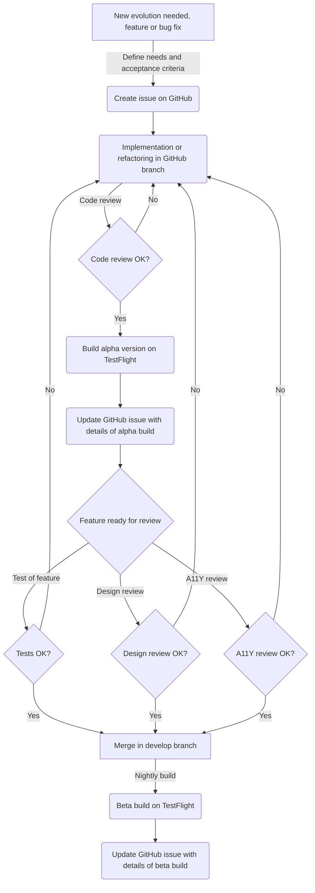

# Contributing to OUDS iOS

Looking to contribute something OUDS iOS? **Here's how you can help.**

Please take a moment to review this document in order to make the contribution process easy for everyone involved.

Following these guidelines helps to communicate that you respect the time of the developers managing and developing this Open Source project.
In return, they should reciprocate that respect in addressing your issue or assessing patches and features.

## Using the Issue Tracker

The [issue tracker](https://github.com/Orange-OpenSource/ouds-ios/issues) is the preferred channel for [bug reports](#bug-reports), [feature requests](#feature-requests) and [submitting pull requests](#pull-requests), but please respect the following restrictions:

- Please **do not** use the issue tracker for personal support requests. [GitHub Discussions](https://github.com/Orange-OpenSource/ouds-ios/discussions/categories/q-a) or our internal Orange communication tools are better places to get help.

- Please **do not** derail or troll issues. Keep the discussion on topic and respect the opinions of others.

- Please **do not** post comments consisting solely of "+1" or ":thumbsup:". Use [GitHub's "reactions" feature](https://blog.github.com/2016-03-10-add-reactions-to-pull-requests-issues-and-comments/) instead. We reserve the right to delete comments which violate this rule.

## Issues and Labels

Our bug tracker utilizes several labels to help organize and identify issues. Here's what they represent and how we use them:

- `feature` - Issues asking for a new feature to be added, or an existing one to be extended or modified. New features require a minor version bump (e.g., `v1.0.0` to `v1.1.0`) or a major version bump if public API broken (e.g., `v1.0.0` to `v2.0.0`)
- `help wanted` - Issues we need or would love help from the community to resolve.

For a complete look at our labels, see the [project labels page](https://github.com/Orange-OpenSource/ouds-ios/labels).

## Bug Reports

A bug is a _demonstrable problem_ that is caused by the code in the repository. Good bug reports are extremely helpful, so thanks!

Guidelines for bug reports:

1. **Use the GitHub issue search** &mdash; check if the issue has already been reported.

2. **Check if the issue has been fixed** &mdash; try to reproduce it using the latest `develop` in the repository.

3. **Isolate the problem** &mdash; ideally create a reduced reproducible test case.

A good bug report shouldn't leave others needing to chase you up for more information. Please try to be as detailed as possible in your report. What is your environment? What steps will reproduce the issue? What device(s) and OS experience the problem? Do other devices show the bug differently? What would you expect to be the outcome? All these details will help people to fix any potential bugs.

Example:

> Short and descriptive example bug report title
>
> A summary of the issue and the browser/OS environment in which it occurs. If
> suitable, include the steps required to reproduce the bug.
>
> 1. This is the first step
> 2. This is the second step
> 3. Further steps, etc.
>
> `<url>` - a link to the reduced test case
>
> Any other information you want to share that is relevant to the issue being
> reported. This might include the lines of code that you have identified as
> causing the bug, and potential solutions (and your opinions on their
> merits).

## Feature Requests

Feature requests are welcome. But take a moment to find out whether your idea fits with the scope and aims of the project. It's up to _you_ to make a strong case to convince the project's developers of the merits of this feature. Please provide as much detail and context as possible.

## Pull requests

Good pull requests (patches, improvements, new features) are a fantastic help. They should remain focused in scope and avoid containing unrelated commits.

**Please ask first** before embarking on any **significant** pull request (e.g. implementing features, refactoring code, porting to a different language), otherwise you risk spending a lot of time working on something that the project's developers might not want to merge into the project. For trivial things, or things that don't require a lot of your time, you can go ahead and make a PR.

Please adhere to the [coding guidelines](#code-guidelines) used throughout the project (indentation, accurate comments, etc.) and any other requirements (such as test coverage).

Adhering to the following process is the best way to get your work included in the project:

1. [Fork](https://help.github.com/articles/fork-a-repo/) the project, clone your fork, and configure the remotes:

   ```bash
   # Clone your fork of the repo into the current directory (use either SSH or HTTPS)
   git clone https://github.com/<your-username>/ouds-ios.git
   # Navigate to the newly cloned directory
   cd ouds-ios
   # Assign the original repo to a remote called "upstream" (use either SSH or HTTPS)
   git remote add upstream https://github.com/Orange-OpenSource/ouds-ios.git
   ```

2. If you cloned a while ago, get the latest changes from upstream:

   ```bash
   git checkout develop
   git pull upstream develop
   ```

3. Create a new topic branch (off the `develop` project development branch) to contain your feature, change, or fix:

   ```bash
   git checkout -b <topic-branch-name> develop
   ```

4. Commit your changes in logical chunks. Use Git's [interactive rebase](https://help.github.com/articles/about-git-rebase/) feature to tidy up your commits before making them public. Refer also to [commits style](#commits-style).

5. Locally merge (or rebase) the upstream development branch into your topic branch:

   ```bash
   git pull [--rebase] upstream develop
   ```

6. Push your topic branch up to your fork:

   ```bash
   git push origin <topic-branch-name>
   ```

7. [Open a Pull Request](https://help.github.com/articles/about-pull-requests/) with a clear title and description against the `develop` branch.

**IMPORTANT**: By submitting a patch, you agree to allow the project owners to license your work under the terms of the [MIT License](LICENSE).

Note that a ruleset based [on task-list-completed tool](https://github.com/marketplace/task-list-completed) is applied on `develop` branch: if any prerequisites are not futfilled in the pull request ticket the merge won't be done. 

## Code Guidelines

### Checking Coding Style

Format your code before committing to ensure your changes follow our coding standards.

## Commits style

Try as best as possible to apply [conventional commits rules](https://www.conventionalcommits.org/en/v1.0.0/).
Keep in mind to have your commits well prefixed, and with the issue number between parenthesis at the end.
If your commits embed contributions for other people, do not forget to [add them as co-authors](https://docs.github.com/fr/pull-requests/committing-changes-to-your-project/creating-and-editing-commits/creating-a-commit-with-multiple-authors). All of you should also comply to DCO.

For example, given a commit to fix the issue n°43, the commit should be like:

```text
fix: title of your commit (#43)

Some details about the fix you propose

Co-authored-by: First author firstname and lastname <first author email>
Co-authored-by: Second author firstname and lastname <second author email>

Signed-off-by: First author firstname and lastname <first author email>
Signed-off-by: Second author firstname and lastname <second author email>
```

## Review workflow

Because we want to define and provide an amazing design system for developers, we want to onboard for any evolutions the Q/A team for tests and also the design ans accessibiltiy (a11y) teams so as to check the fixes, patches or evolutions have been well implemented and tested.

The following chart explain how the review is done with also the intermediate alpha builds.
In few words, alpha builds are made for reviewers, and the merge is processed if and only if any review have been done.
The [task-list-completed GitHub app](https://github.com/apps/task-list-completed) prevents pull requests to be merged if some mandatory / not optional prerequisites are not filled.



## License

By contributing your code, you agree to license your contribution under the [MIT License](LICENSE).
