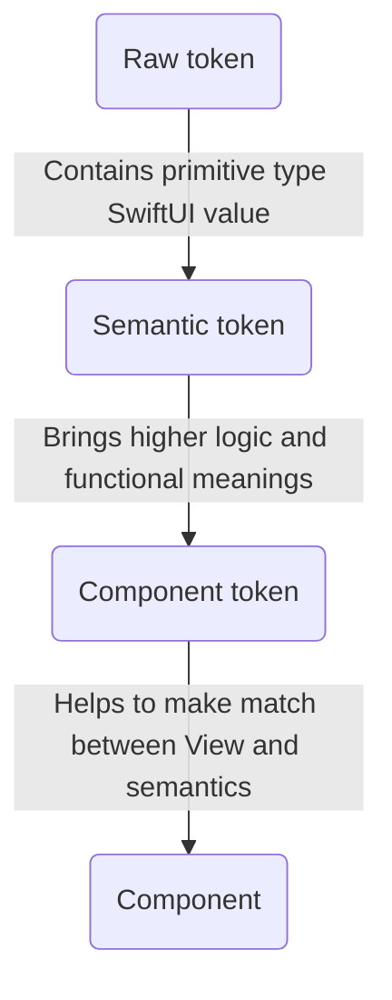
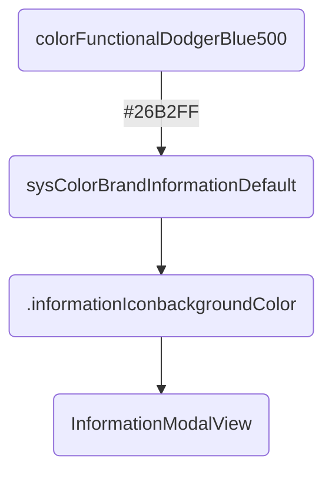

# Tokens

Design tokens represent the small, repeated design decisions that make up a design system's visual style. Tokens wrap hard-coded static values, such as hexadecimal codes for color, with self-explanatory names.

About responsabilities:


Example:


*You can have the graphical rendering of this _Mermaid_ charts in the [README markdown](https://github.com/Orange-OpenSource/ouds-ios/blob/develop/OUDS/README.md).*
*Frustrated? Boost [that issue](https://github.com/swiftlang/swift-docc-render/issues/413)*

## Component tokens

No _tokens_ ([OUDSTokensComponent](https://ios.unified-design-system.orange.com/documentation/oudstokenscomponent/)) are defined for components yet.

## Semantic tokens

### What they are

These _tokens_ ([OUDSTokensSemantic](https://ios.unified-design-system.orange.com/documentation/oudstokenssemantic/)) can be used mainly for _component tokens_ to apply some style and configuration values.
They can be seen as an high level of usage with functional meanings.

A semantic token points to a raw token, and is used by components. A semantic token brings meanings, higher level notions. For example, a raw token can be a "red color", and a semantic token pointing to it can be a "danger information color". Semantic tokens are used by components tokens and shared definition of themes. They are splitted in kind of families, i.e. borders, colors, spacings, elevations, sizings, opacities, grids and fonts. For some of theses tokens, like for borders, subfamilies can be defined likes width, radius and style. Finally, any of these semantic tokens is associated to a raw value which will be - in the end - applied to SwiftUI views inside components. Type aliases will help to make a simple match between any semantic tokens and raw tokens. Thus if we need for example to change a warning color, supposing this color is defined as a _semantic token_, we only have to change its assigned value and all components using the _semantic token_ won't be impacted in their definition, only their rendering.

In addition, there are hundreds of _semantics tokens_ and we needed to add them to the abstract root theme using extensions for clarity reasons to prevent to have a _Swift class_ with thousands of lines. Each _semantic token_ "family" is then declared in its dedicated _Swift protocol_ any root theme must implement through prociders. Because we choose to split responsabilities and objects into their own modules, we faced troubles to make possible for children themes to override properties declared in _protocols_ and defined in _extensions_.

That is the reason why tokens are exposed as `@objc open` to be available and overridable anywhere. 

To keep the same semantics as the ones used in our specifications, _typealias_ are used to as to make the links to _primitive types_ and our logic of _tokens_. These type aliases are available for those who want to make their own theme. It's only syntaxic sugar to bring _design words_ in our product.

Example with [OUDSTokensComponent/ColorSemanticTokens](https://ios.unified-design-system.orange.com/documentation/oudstokenssemantic/colorsemantictokens):

```swift
// Declare the semantic tokens
protocol ColorSemanticTokens {

    var colorBgPrimary: ColorSemanticToken { get }
    var colorBgSecondary: ColorSemanticToken { get }
    var colorBgTertiary: ColorSemanticToken { get }
    // ...
}

// Define the semantic tokens exposed through the theme
extension OUDSColorSemanticTokensProvider: ColorSemanticTokens {

    // Color is available in the module of OUDSTheme
    @objc open var colorBgPrimary: ColorSemanticToken { ColorRawTokens.colorFunctionalWhite }

    // If the semantic token refers to a raw token not stored in the OUDSTheme module, override later and throw error because unxpected state if used
    @objc open var colorBgSecondary: ColorSemanticToken { fatalError("🤖 Raw token unavailable for colorBgSecondary!") }

    // Possible to have tokens not defined in lower level but only in themes implementation, throw error if used because unexpected state
    @objc open var colorBgTertiary: ColorSemanticToken { fatalError("🤖 No value defined for colorBgTertiary!") }
}

// Add missing values
extension OrangeColorSemanticTokensProvider: OUDSColorSemanticTokensProvider {

    // Define value value with the accessible token 
    @objc open var colorBgSecondary: ColorSemanticToken { OrangeBrandColorRawTokens.colorOrange200 }

    @objc open var colorBgTertiary: ColorSemanticToken { colorBgSecondary }
}
```

### Important notice

You may see the source code can be more simple, or the source code does not follow the Swift guidelines, or plenty of warnings of SwiftLint are disabled, or things are dirty.

In fact, we rely to much on *Figma* and how the design system is implemented.
There are thousands of tokens, and we do now know if they will be used, how and by whom. In addition, the logic behind these tokens, their nature and names, is very tight to the web domain because the design team behind is more used to web environment than mobile ones like Android and iOS. Some tokens like composite tokens are defined in *Figma* but *Figma* is not able to manage them, it is tinkering, and the outputed JSON cannot manage that too.
In addition, *Figma* exposes the tokens in JSON, which is then parsed with our own fork and implementation of _style dictionary_ tool which struggles to outputs the JSON to web, Kotlin and Swift assets.

That is the reason why:
- some *SwiftLint* warnings on tokens are disabled: not possible to have doc of public tokens, too long names, too long lines, too long body, too long identifiers
- some tokens do not have full names, e.g. "colorBackground" are named "colorBg"
- somes tokens are defined without attached values, thus we throw `fatalError` because that state is not relevant
- some tokens in the *Figma* use colors defined in another module, thus we throw `fatalError` to force themes to override with the good and avaialble values
- we have thousands of tokens, as thousands of tokens are defined
- we do not know if there is dead code because API are public

Feel free to send issues and contact us for further details or if you spotted something interesting.

## Raw tokens

### What they are

_Raw tokens_ ([OUDSTokensRaw](https://ios.unified-design-system.orange.com/documentation/oudstokensraw/)) are smallest _tokens_ possible. They are associated to raw values and will be finaly the values assigned to the _components_ properties.

In fact, we choose to use as most as possible primitive types for raw values, like `Int`, `Double`, `CGFloat` or `String` so as to handle the smallest types with few impacts on the memory for ecodesign principles. Indeed with hundreds of raw tokens, it will be more efficient to store primitive small types than *structs* or *classes*.

So we expose also in higher level some properties so as to convert when needed some of these types to `SwiftUI` types (like `Font.Weight` and `Color`).

To keep the same semantics as the ones used in our specifications, _typealias_ are used to as to make the links to _primitive types_ and our logic of _tokens_. These type aliases are available for those who want to make their own theme.

Using more simple and primitive types will help also to test the library. With also type aliases we force users to use our types and not higher level types like _SwiftUI_ types.

We also choose to add in _extension_ all the tokens values in a separated file so as to help the *Figma*-JSON-to-Swift parser to build files to copy and past easily in the project and keeping all the other objects.

Example for [ColorRawTokens](https://ios.unified-design-system.orange.com/documentation/oudstokensraw/colorrawtokens):

```swift
// Define type alias for color raw tokens, we don't care in higher level their real type, just use aliases
public typealias ColorRawToken = String

public enum ColorRawTokens { } 

extension ColorRawTokens { // Gathers all color raw tokens, use enums for namespace optimization with static let

    public static let colorFunctionalWhite: ColorRawToken = "#FFFFFF"
    public static let colorOpacityBlack0: ColorRawToken = "#00000000"
    ...
}

extension String { // The OUDS library still exposes this comptuer property
    public var color: Color {
        Color(hexadecimalCode: self)
    }
}

// Themes can embed their own tokens
enum OrangeBrandColorRawTokens {
    public static let colorOrange200: ColorOrangeBrandRawToken = "#FFC18A"
}
```

## Add, edit or remove tokens

If you need to add, edit or remove tokens, you will have to follow some simple steps.
You may need to [create an issue](https://github.com/Orange-OpenSource/ouds-ios/issues) or [a pull request](https://github.com/Orange-OpenSource/ouds-ios/pulls) to submit the evolutions you want. Use for example the _Token Update Request_ issue template.
Do not forget to add or update unit tests in order to make assertions on some rules and properties of raw tokens, and the capability of semantic tokens overridings.

### For raw tokens

You can refer to the *OUDSTokensRaw* documentation or [get it online](https://ios.unified-design-system.orange.com/documentation/oudstokensraw/). [The wiki provides details](https://github.com/Orange-OpenSource/ouds-ios/wiki/20-%E2%80%90-How-to-update-tokens) also.

### For semantic tokens

You can refer to the *OUDSTokensSemantic* documentation or [get it online](https://ios.unified-design-system.orange.com/documentation/oudstokenssemantic/). [The wiki provides details](https://github.com/Orange-OpenSource/ouds-ios/wiki/0-%E2%80%90-How-to-update-tokens) also.
