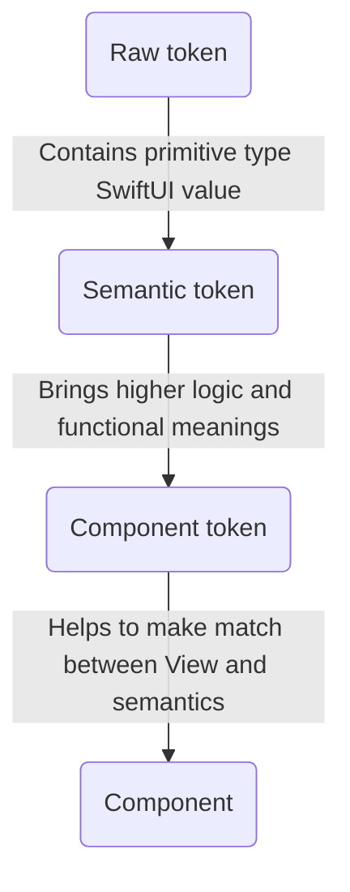
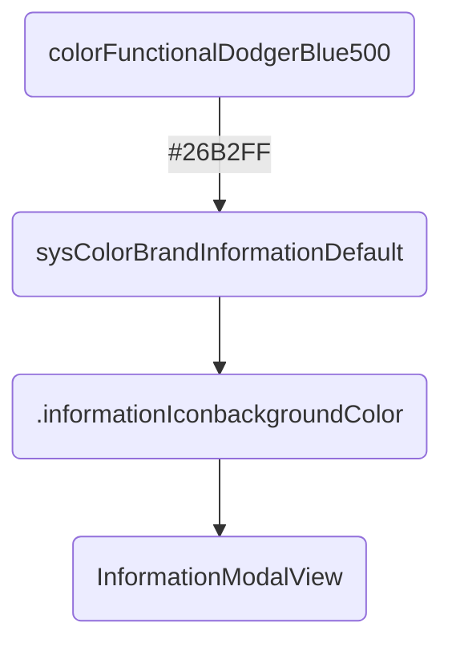

# Tokens

Design tokens represent the small, repeated design decisions that make up a design system's visual style. Tokens replace hard-coded static values, such as hexadecimal codes for color, with self-explanatory names.

About responsabilities:


Example:


*You can have the graphical rendering of this _Mermaid_ charts in the [README markdown](https://github.com/Orange-OpenSource/ouds-ios/blob/develop/OUDS/README.md).*
*Frustrated? Boost [the issue we submitted](https://github.com/swiftlang/swift-docc/issues/1026)*

## Component tokens

These _tokens_ ([OUDSTokensComponent](https://ios.unified-design-system.orange.com/documentation/oudstokenscomponent/)) can be used to apply some style and configuration values to _components_.
Thus if a component needs to change for example its _background color_, and if a _component token_ is used for it, then only the value of this _token_ should be changed without any modification on the _component_ definition.
_Components_ use _component tokens_ exposed through the _theme_ to get their style values.

Example with a fake component `FormsTextInputComponentTokens`:

```swift
// Declare the component tokens
public protocol FormsTextInputComponentTokens {
    var ftiTitleFontWeight: TypographyFontWeightSemanticToken { get }
    var ftiTitleFontSize: TypographyFontSizeSemanticToken { get }
    var ftiTitleColor: ColorSemanticToken { get }
    
    var ftiBorderColor: ColorSemanticToken { get }
    var ftiBorderStyle: BorderStyleSemanticToken { get }
    var ftiBorderWidth: BorderWidthSemanticToken { get }
}

// Define the component tokens
extension OUDSTheme: FormsTextInputComponentTokens {
    private static let defaultBlack: ColorSemanticToken = ColorRawTokens.colorFunctionalBlack
    private static let defaultWhite: ColorSemanticToken = ColorRawTokens.colorFunctionalWhite

    @objc open var ftiTitleFontWeight: TypographyFontWeightSemanticToken { fontWeightHeading }
    @objc open var ftiTitleFontSize: TypographyFontSizeSemanticToken { fontSizeLabelLarge }
    @objc open var ftiTitleColor: ColorSemanticToken { colorContentBrandPrimaryLight ?? Self.defaultBlack }
    
    @objc open var ftiBorderColor: ColorSemanticToken { colorBorderEmphasizedLight ?? Self.defaultBlack }
    @objc open var ftiBorderStyle: BorderStyleSemanticToken { borderStyleDefault }
    @objc open var ftiBorderWidth: BorderWidthSemanticToken { borderWidthThin }
}

// Then in the definition of the component FormsTextInput component, the theme will be called and the component tokens
// stored inside will be applied
// The View

struct OUDSFormsTextInput: View {

    // ...
    @Environment(\.theme) var theme

    public var body: some View {
        VStack(spacing: theme.spacePaddingBlockComponentTall) {
            Label(
                title: {
                    Text("Example of OUDSFormsTextInput")
                        .fontWeight(theme.ftiTitleFontWeight.fontWeight)
                        .font(.system(size: theme.ftiTitleFontSize))
                        .foregroundColor(theme.ftiTitleColor.color)
                },
                icon: { /*@START_MENU_TOKEN@*/Image(systemName: "42.circle")/*@END_MENU_TOKEN@*/ }
            )
            Text("Write bellow some awesome text!")
                .fontWeight(theme.ftiSubtitleFontWeight.fontWeight)
                .font(.system(size: theme.ftiSubtitleFontSize))
                .foregroundColor(theme.ftiSubtitleColor.color)
            TextField(placeholder, text: $value)
        }
        .padding(theme.spacePaddingBlockComponentTall)
        .background(colorScheme == .light ? theme.ftiBackgroundColorLight.color : theme.ftiBackgroundColorDark.color)
        .border(theme.ftiBorderColor.color, width: theme.ftiBorderWidth)
    }
}
```

## Semantic tokens

These _tokens_ ([OUDSTokensSemantic](https://ios.unified-design-system.orange.com/documentation/oudstokenssemantic/)) can be used mainly for _component tokens_ to apply some style and configuration values.
They can be seen as an high level of usage with functional meanings.
Thus if we need for example to change a warning color, supposing this color is defined as a _semantic token_, we only have to change its assigned value and all components using the _semantic token_ won't be impacted in their definition.

In addition, there are hundreds of _semantics tokens_ and we needed to add them to the abstract root theme using extensions for clarity reasons to prevent to have a _Swift class_ with thousands of lines. Each _raw token_ "family" is then declared in its dedicated _Swift protocol_ any root theme must implement. Because we choose to split responsabilities and objects into their own modules, we faced troubles to make possible for children themes to override properties declared in _protocols_ and defined in _extensions_.

That is the reason why tokens are exposed as `@objc open` to be available and overridable anywhere. 

To keep the same semantics as the ones used in our specifications, _typealias_ are used to as to make the links to _primitive types_ and our logic of _tokens_. These type aliases are available for those who want too make their own theme. It's only syntaxic sugar to bring _design words_ in our product.

Example with [OUDSTokensComponent/ColorSemanticTokens](https://ios.unified-design-system.orange.com/documentation/oudstokenssemantic/colorsemantictokens):

```swift
// Declare a semantic token for color
protocol ColorSemanticTokens {
    var sysColorBrandNeutralMutedWhite: ColorAliasSemanticToken? { get }
}

// Define the semantic token
extension OUDSTheme: ColorSemanticTokens {

    @objc open var sysColorBrandNeutralMutedWhite: ColorAliasSemanticToken? { ColorRawTokens.colorFunctionalWhite }
}

// Then any component and view can use the theme and get the stored colors, only manipulating them by their variable names.
```

## Raw tokens

_Raw tokens_ ([OUDSTokensRaw](https://ios.unified-design-system.orange.com/documentation/oudstokensraw/)) are smallest _tokens_ possible. They are associated to raw values and will be finaly the values assigned to the _components_ properties.

In fact, we choose to use as most as possible primitive types for raw values, like `Int`, `Double`, `CGFloat` or `String` so as to handle the smallest types with few impacts on the memory for ecodesign principles. Indeed with hundreds of raw tokens, it will be more efficient to store primitive small types than *structs* or *classes*.

So we expose also in higher level some properties so as to convert when needed some of these types to `SwiftUI` types (like `Font.Weight` and `Color`).

To keep the same semantics as the ones used in our specifications, _typealias_ are used to as to make the links to _primitive types_ and our logic of _tokens_. These type aliases are available for those who want too make their own theme.

Using more simple and primitive types will help also to test the library. With also type aliases we force users to use our types and not higher level types like _SwiftUI_ types.

We also choose to add in _extension_ all the tokens values in a separated file so as to help the *Figma*-JSON-to-Swift parser to build files to copy and past easily in the project and keeping all the other objects.

Example for [ColorRawTokens](https://ios.unified-design-system.orange.com/documentation/oudstokensraw/colorrawtokens):

```swift
// Define type alias for color raw tokens, we don't care in higher level their real type, just use aliases
public typealias ColorRawToken = String

public enum ColorRawTokens { } 

extension ColorRawTokens { // Gathers all color raw tokens, use enums for namespace optimization with static let

    public static let colorFunctionalWhite: ColorRawToken = "#FFFFFF"
    public static let colorFunctionalScarlet400: ColorRawToken = "#FF4D4E"
    public static let colorTransparentBlack0: ColorRawToken = apply(opacity: OpacityRawTokens.opacity0, on: colorFunctionalBlack)
    ...
}

extension String { // The OUDS library still exposes this comptuer property
    public var color: Color {
        Color(hexadecimalCode: self)
    }
}
```

## Add, edit or remove tokens

If you need to add, edit or remove tokens, you will have to follow some simple steps.
You may need to [create an issue](https://github.com/Orange-OpenSource/ouds-ios/issues) or [a pull request](https://github.com/Orange-OpenSource/ouds-ios/pulls) to submit the evolutions you want.

### For raw tokens

First, find the file containing the tokens you target. For example, _raw tokens_ are listed and gathered in dedicated files (one file for elevation tokens, one file for dimensions tokens, etc.).
Then, in the _enum_, add as _static let_ the new raw rotken you want, or update or remove the one you target. Beware, some of them are not *raw types* but *composite types* because they wrap severla values.

Do not forget to update the unit tests. Indeed we don't want to test realy the values of each raw token, because for each update of values the unit tests will have to be updated, and it is time wasting. Thus we only test relationship between tokens. For exemple, for a color palette we ensure the colors are lighter and lighter (or darker and darker). For sizes we check if a variable remains lower than the next one, etc.

Beware, if you want remove tokens and if the raw tokens you want to remove are shared to others, prefer keeping the old value until the next release and flag it as deprecated so as to avoid to break the backward compatibility.

### For semantic tokens

Semantic tokens are declared in dedicated protocols, i.e. each semantic token family is gathered in its own protocol definition. It allows to not spread tokens everywhere, keep things clean, and will force themes to implement them so as to be sure the tokens will always been defined.
You may need thus to add the semantic tokens you want in the suitable protocol, then update the theme which defines the vavlues by implementing the protocol.
You can declare a semantic token (or several) in a protocol, and define them in your theme assigning in the end a raw token as value.

Do not forget to update the unit tests. Indeed we don't tests the real values of the semantic tokens which can change a lot, but we test if the semantic tokens can be overriden, i.e. if a theme which is a subclass of an higher level them can change the value for each semantic token. It will ensure that tokens remain overridable.

Beware, if you want remove tokens and if the semantic tokens you want to remove are shared to others, prefer keeping the old value until the next release and flag it as deprecated so as to avoid to break the backward compatibility.
