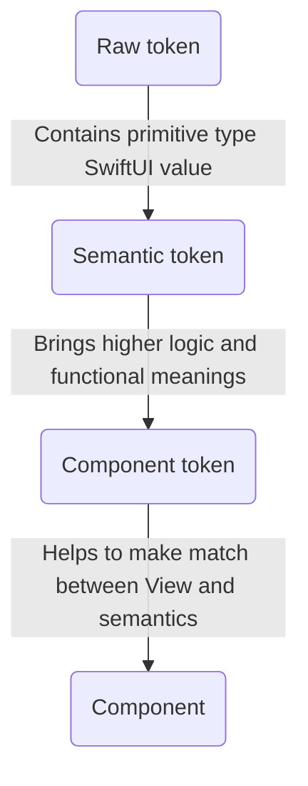
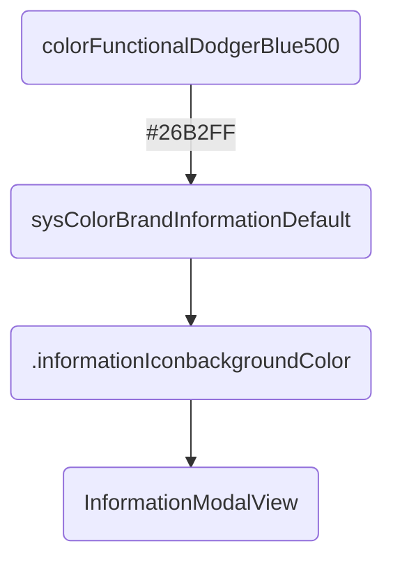

# Tokens

Design tokens represent the small, repeated design decisions that make up a design system's visual style. Tokens replace hard-coded static values, such as hexadecimal codes for color, with self-explanatory names.

About responsabilities:


Example:


*You can have the graphical rendering of this _Mermaid_ charts in the [README markdown](https://github.com/Orange-OpenSource/ouds-ios/blob/develop/OUDS/README.md).*
*Frustrated? Boost [the issue we submitted](https://github.com/swiftlang/swift-docc/issues/1026)*

## Component tokens

No _tokens_ ([OUDSTokensComponent](https://ios.unified-design-system.orange.com/documentation/oudstokenscomponent/)) are defined for components yet.

## Semantic tokens

These _tokens_ ([OUDSTokensSemantic](https://ios.unified-design-system.orange.com/documentation/oudstokenssemantic/)) can be used mainly for _component tokens_ to apply some style and configuration values.
They can be seen as an high level of usage with functional meanings.
Thus if we need for example to change a warning color, supposing this color is defined as a _semantic token_, we only have to change its assigned value and all components using the _semantic token_ won't be impacted in their definition.

In addition, there are hundreds of _semantics tokens_ and we needed to add them to the abstract root theme using extensions for clarity reasons to prevent to have a _Swift class_ with thousands of lines. Each _raw token_ "family" is then declared in its dedicated _Swift protocol_ any root theme must implement. Because we choose to split responsabilities and objects into their own modules, we faced troubles to make possible for children themes to override properties declared in _protocols_ and defined in _extensions_.

That is the reason why tokens are exposed as `@objc open` to be available and overridable anywhere. 

To keep the same semantics as the ones used in our specifications, _typealias_ are used to as to make the links to _primitive types_ and our logic of _tokens_. These type aliases are available for those who want to make their own theme. It's only syntaxic sugar to bring _design words_ in our product.

Example with [OUDSTokensComponent/ColorSemanticTokens](https://ios.unified-design-system.orange.com/documentation/oudstokenssemantic/colorsemantictokens):

```swift
// Declare the semantic tokens
protocol ColorSemanticTokens {

    var colorBackgroundPrimary: ColorSemanticToken { get }
    var colorBackgroundSecondary: ColorSemanticToken { get }
    var colorBackgroundTertiary: ColorSemanticToken { get }
    // ...
}

// Define the semantic tokens exposed through the theme
extension OUDSTheme: ColorSemanticTokens {

    // Color is available in the module of OUDSTheme
    @objc open var colorBackgroundPrimary: ColorSemanticToken { ColorRawTokens.colorFunctionalWhite }

    // If the semantic token refers to a raw token not stored in the OUDSTheme module, override later and throw error because unxpected state if used
    @objc open var colorBackgroundSecondary: ColorSemanticToken { fatalError("🤖 Raw token unavailable for colorBackgroundSecondary!") }

    // Possible to have tokens not defined in lwoer level must only in themes implementation, throw error if used because unexpected state
    @objc open var colorBackgroundTertiary: ColorSemanticToken { fatalError("🤖 No value defined for colorBackgroundTertiary!") }
}

// Add missing values
extension OrangeTheme: ColorSemanticTokens {

    // Define value value with the accessible token 
    @objc open var colorBackgroundSecondary: ColorSemanticToken { OrangeBrandColorRawTokens.colorOrange200 }
}
```

## Raw tokens

_Raw tokens_ ([OUDSTokensRaw](https://ios.unified-design-system.orange.com/documentation/oudstokensraw/)) are smallest _tokens_ possible. They are associated to raw values and will be finaly the values assigned to the _components_ properties.

In fact, we choose to use as most as possible primitive types for raw values, like `Int`, `Double`, `CGFloat` or `String` so as to handle the smallest types with few impacts on the memory for ecodesign principles. Indeed with hundreds of raw tokens, it will be more efficient to store primitive small types than *structs* or *classes*.

So we expose also in higher level some properties so as to convert when needed some of these types to `SwiftUI` types (like `Font.Weight` and `Color`).

To keep the same semantics as the ones used in our specifications, _typealias_ are used to as to make the links to _primitive types_ and our logic of _tokens_. These type aliases are available for those who want to make their own theme.

Using more simple and primitive types will help also to test the library. With also type aliases we force users to use our types and not higher level types like _SwiftUI_ types.

We also choose to add in _extension_ all the tokens values in a separated file so as to help the *Figma*-JSON-to-Swift parser to build files to copy and past easily in the project and keeping all the other objects.

Example for [ColorRawTokens](https://ios.unified-design-system.orange.com/documentation/oudstokensraw/colorrawtokens):

```swift
// Define type alias for color raw tokens, we don't care in higher level their real type, just use aliases
public typealias ColorRawToken = String

public enum ColorRawTokens { } 

extension ColorRawTokens { // Gathers all color raw tokens, use enums for namespace optimization with static let

    public static let colorFunctionalWhite: ColorRawToken = "#FFFFFF"
    public static let colorTransparentBlack0: ColorRawToken = apply(opacity: OpacityRawTokens.opacity0, on: colorFunctionalBlack)
    ...
}

extension String { // The OUDS library still exposes this comptuer property
    public var color: Color {
        Color(hexadecimalCode: self)
    }
}

// Themes can embed their own tokens
enum OrangeBrandColorRawTokens {
    public static let colorOrange200: ColorOrangeBrandRawToken = "#FFC18A"
}
```

## Add, edit or remove tokens

If you need to add, edit or remove tokens, you will have to follow some simple steps.
You may need to [create an issue](https://github.com/Orange-OpenSource/ouds-ios/issues) or [a pull request](https://github.com/Orange-OpenSource/ouds-ios/pulls) to submit the evolutions you want. Use for example the _Token Update Request_ issue template.

### For raw tokens

You can refer to the *OUDSTokensRaw* documentation or [get it online](https://ios.unified-design-system.orange.com/documentation/oudstokensraw/)

### For semantic tokens

You can refer to the *OUDSTokensSemantic* documentation or [get it online](https://ios.unified-design-system.orange.com/documentation/oudstokenssemantic/
