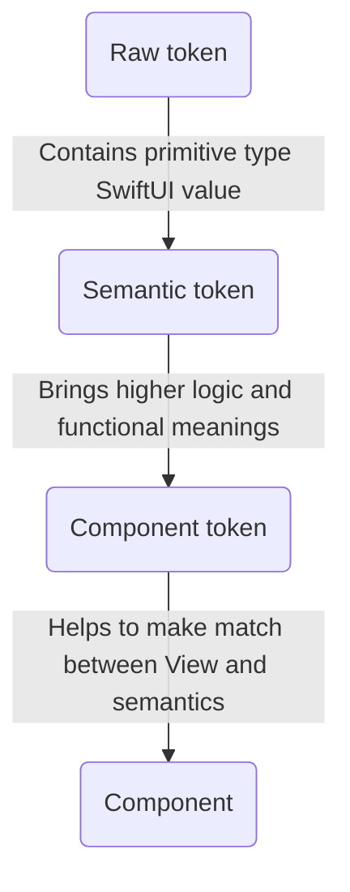
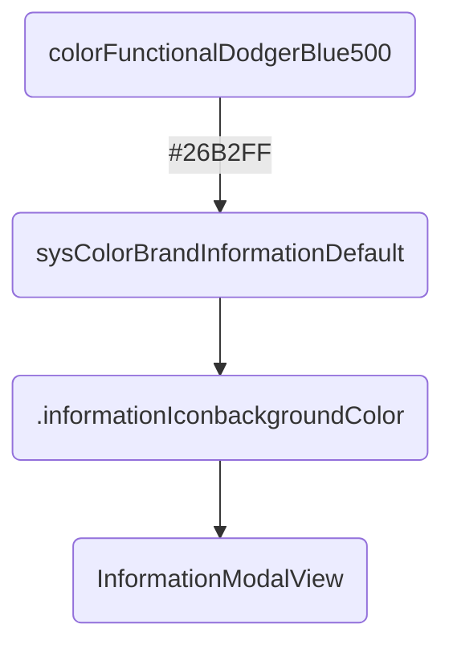

# OUDS Swift Package

## Summary

This is the _Swift package_ for the iOS library of *Orange Unified Design System*.
It contains modules, components, themes, and tokens (of components,s emantic and raw) defined by the design team in charge of a unified design.

## Exposed SPM modules

This _Swift package_ exposes up to #0 _products_ as _libraries_:
1. `OUDSModules` containing OUDS modules with features ;
2. `OUDSComponents` containing all components embeded also inside _modules_ ;
3. `OUDSThemesSoshTheme` providing the default _Sosh_ theme defining style for _components_;
4. `OUDSThemesInverseTheme` providing a _theme_ with inversed colors for _components_;
5. `OUDSThemesOrangeTheme` providing the default _Orange_ theme defining style for _components_;
6. `OUDSThemesShared` providing basic objects and low layer of responsabilities to help to implement _themes_ ;
7. `OUDSTokensComponent` providing _component tokens_ for _components_ to add in applications and _modules_ ;
8. `OUDSTokensSemantic` providing _semantic tokens_ ; 
9. `OUDSTokensRaw` providing _raw tokens_ ;
10. `OUDSFoundations` providing low level and utils objects.

Feel free to read [this Swift documentation](https://docs.swift.org/package-manager/PackageDescription/PackageDescription.html) if you are not used to _SPM_.

## Core

### Components

_Components_ are defined here and can be integrated in applications.

### Themes

_Themes_ are applications of specific values for _components tokens_ and _semantic tokens_.
A _theme_ contains any relevant _semantic tokens_ and _component tokens_ which can be sued for components rendering.
A _theme_ has also _raw tokens_ associated to primitive types so as to give to _components_, written with _SwiftUI_, the needed values in the suitable type. A _theme_ can add for itself any new _tokens_.

This library exposes today up to two themes:
1. `OrangeTheme` which can be seen as the default _theme_
2.  `SoshTheme` for Sosh.

They both are based on an `OUDSTheme` defining default values.

_Themes_ car defined thanks to `open class` in Swift. It allows inheritance and derivation.
_Themes_ have Swift _extensions_ so as to get the _tokens_ to define. These tokens are overriden thanks to `@objc open` combination so as to make possible to override these values in extensions (thanks to `@objc`) and from objects outside the module (thanks to `open`). Thus we can split values and responsabilities in different _Swift Package Manager targets_ and keep overriding and inheritance possible?

### Tokens

About responsabilities:


Example:


#### Component tokens

These _tokens_ can be used to apply some style and configuration values to _components_.
Thus if a component need to change for example its _background color_, and if a _component token_ is used for it, then only the value of this _token_ should be changed without any modification on the _component_ definition.
_Components_ use _component tokens_ exposed through the _theme_ to get their style values.

Example with `FormsTextInputComponentToken`:

```swift
public protocol FormsTextInputComponentToken {
    var ftiTitleFontWeight: TypographyFontWeightSemanticToken { get }
    var ftiTitleFontSize: TypographyFontSizeSemanticToken { get }
    var ftiTitleColor: ColorSemanticToken { get }
    
    var ftiBorderColor: ColorSemanticToken { get }
    var ftiBorderStyle: BorderStyleSemanticToken { get }
    var ftiBorderWidth: BorderWidthSemanticToken { get }
}

extension OUDSTheme: FormsTextInputComponentToken {
    private static let defaultBlack: ColorSemanticToken = ColorRawTokens.colorFunctionalBlack
    private static let defaultWhite: ColorSemanticToken = ColorRawTokens.colorFunctionalWhite

    @objc open var ftiTitleFontWeight: TypographyFontWeightSemanticToken { fontWeightHeading }
    @objc open var ftiTitleFontSize: TypographyFontSizeSemanticToken { fontSizeLabelLarge }
    @objc open var ftiTitleColor: ColorSemanticToken { colorContentBrandPrimaryLight ?? Self.defaultBlack }
    
    @objc open var ftiBorderColor: ColorSemanticToken { colorBorderEmphasisLight ?? Self.defaultBlack }
    @objc open var ftiBorderStyle: BorderStyleSemanticToken { borderStyleDefault }
    @objc open var ftiBorderWidth: BorderWidthSemanticToken { borderWidthThin }
}

```

#### Semantic tokens

These _tokens_ can be used mainly for _component tokens_ to apply some style and configuration values.
They can be seen as an high level of usage with functional meanings.
Thus if we need for example to change a warning color, supposing this color is defined as a _semantic token_, we onlyhave to change its assigned value and all components using the _semantic token_ won't be impacted in their definition.
In addition, there are hundreds of _semantics tokens_ and we needed to add them to the abstract root theme using extensions for clarity reasons to prevent to have a _Swift class_ with thousands of lines. Each _raw token_ "family" is then declared in its dedicated _Swift protocol_ any root theme must implement. Because we choose to split responsabilities and objects into their own modules, we faced troubles to make possible for children themes to override properties declared in _protocols_ and defined in _extensions_.
That is the reason why tokens are exposed as `@objc open` to be available and oveeridable anywhere. 
To keep the same semantics as the ones used in our specifications, _typealias_ are used to as to make the links to _primitive types_ and our logic of _tokens_. These type aliases are avaialble for those who want too make their own theme.

Example with `ColorSemanticTokens`:

```swift
protocol ColorSemanticTokens {
    var sysColorBrandNeutralMutedWhite: ColorAliasSemanticToken? { get }
}

extension OUDSTheme: ColorSemanticTokens {

    @objc open var sysColorBrandNeutralMutedWhite: ColorAliasSemanticToken? { ColorRawTokens.colorFunctionalWhite }
}
```

#### Raw tokens

_Raw tokens_ are smallest _tokens_ possible. They are associated to raw values and will be finaly the values assigned to the _components_ properties.

In fact, we choose to use as most as possible primitive types for raw values, like `Int`, `Double`, `CGFloat` or `String` so as to handle the smallest types with few impacts on the memory for ecodesign principles. Indeed with hundreds of raw tokens, it will be more efficient to store primitive small types than structs of classes.
So we expose also in higher level some properties so as to convert when needed some of these types to `SwiftUI` types (like `Font.Weight` and `Color`).
To keep the same semantics as the ones used in our specifications, _typealias_ are used to as to make the links to _primitive types_ and our logic of _tokens_. These type aliases are avaialble for those who want too make their own theme.

Using more simple and primitive types will help also to test the library. With also type aliases we force users to use our types and not higher level types like _SwiftUI_ types.

Example for `ColorRawTokens`:

```swift
// Define types for color raw tokens
public typealias ColorRawToken = String

public struct ColorRawTokens { // Gathers all color raw tokens

    public static let colorFunctionalWhite: ColorRawToken = "#FFFFFF"
    public static let colorFunctionalScarlet400: ColorRawToken = "#FF4D4E"
    public static let colorTransparentBlack0: ColorRawToken = apply(opacity: OpacityRawTokens.opacity0, on: colorFunctionalBlack)
    ...
}

extension String {
    public var color: Color {
        Color(hexadecimalCode: self)
    }
}
```

## Foundations

_Foundations_ contain some extensions and objects shared between any higher levels of the library.

## Modules

A _module_ can be seen as a set of features and components to fill a need.
There is not module yet.

## How to use components

Import the module of components, and use the component you want:

```swift
import OUDSComponents // To get the components

struct YourView: View {

    @State private var writtenText: String = ""

    var body: some View {
        OUDSFormsTextInput(placeholder: "Some placeholder to display", value: $writtenText)
    }
}
```

Of course you must use in your root view the `OUDSThemeableView` with the suitable theme:

```swift
    // The theme can be OrangeTheme or your own
    OUDSThemeableView(theme: theTheme) {
        
    }
``` 

## How to create your own theme

It is quite simple, you have to follow several steps.

First, create a _Swift class_ which will inherit from `OrangeTheme` or `OUDSTheme`.
You can see `OrangeTheme` as more specified and less abtract as `OUDSTheme` which is the base of all themes.
Then, you should override the _semantic tokens_ and _components tokens_ you want ; we recommend to use _Swift extensions_ for clarity reasons.
If your theme needs to define its own _raw tokens_, you can also define them using a `struct` and the _raw tokens types_.

For example:

```swift
import Foundation
import SwiftUI
import OUDSTokensRaw        // To get raw tpkens
import OUDSTokensSemantic   // To get semantic tokens
import OUDSTokensComponent  // To get component tokens
import OUDSThemesOrange     // To override OrangeTheme (which is default theme)

// Can be for example a country theme
class OrangeCustomTheme: OrangeTheme { }

extension OrangeCustomTheme { // For FormsTextInputComponentToken, used in component FormsTextInputComponent

    public override var ftiTitleFontWeight: TypographyFontWeightSemanticToken { fontWeightLabelStrong }
    public override var ftiTitleFontSize: TypographyFontSizeSemanticToken { fontSizeLabelXLarge }
    public override var ftiTitleColor: ColorSemanticToken { ColorRawTokens.colorFunctionalDodgerBlue500 }

    public override var ftiSubtitleFontWeight: TypographyFontWeightSemanticToken { fontWeightBodyDefault }
    public override var ftiSubtitleFontSize: TypographyFontSizeSemanticToken { fontSizeLabelMedium }
    public override var ftiSubtitleColor: ColorSemanticToken { ColorRawTokens.colorFunctionalMalachite500 }

    public override var ftiBackgroundColorLight: ColorSemanticToken { colorBackgroundDefaultPrimaryLight }
    public override var ftiBackgroundColorDark: ColorSemanticToken { colorBackgroundDefaultPrimaryDark }

    public override var ftiBorderColor: ColorSemanticToken { colorBorderEmphasisDark ?? MyThemeColorRawTokens.someAwesomeThemeExclusiveColor }

    public override var ftiBorderStyle: BorderStyleSemanticToken { borderStyleDrag }

    public override var ftiBorderWidth: BorderWidthSemanticToken { borderWidthThickest }
}

extension OrangeCustomTheme { // For ColorSemanticTokens using anywhere

    override var colorBackgroundDefaultPrimaryLight: ColorSemanticToken! { ColorRawTokens.colorFunctionalSun500 }
    override var colorBackgroundDefaultPrimaryDark: ColorSemanticToken! { ColorRawTokens.colorFunctionalSun800 }
}
```

And your own theme colors _raw tokens_:

```swift

public typealias MyThemeColorRawToken = ColorRawToken // Refer to type ColorRawToken for consistency

public struct MyThemeColorRawTokens {

    public static let someAwesomeThemeExclusiveColor: MyThemeColorRawToken = "#12345600"
    
}
```

The for your root view:

```swift
import SwiftUI
import OUDSThemesShared  // To get OUDSThemeableView

struct MyAppRootView: View {

    var body: some View {
        OUDSThemeableView(theme: OrangeCustomTheme()) {
            // ...
        }
    }
}
