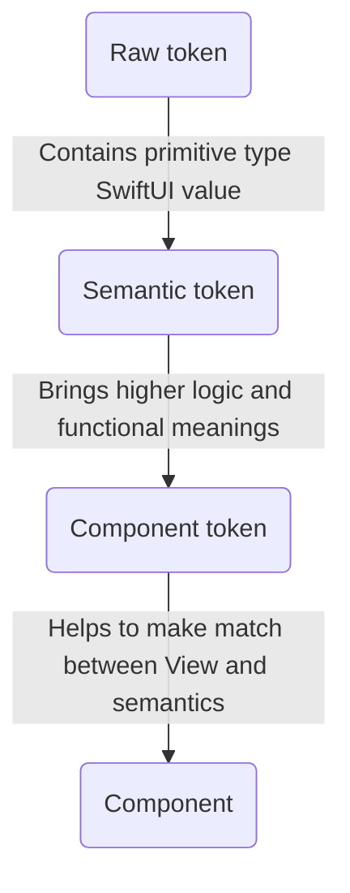
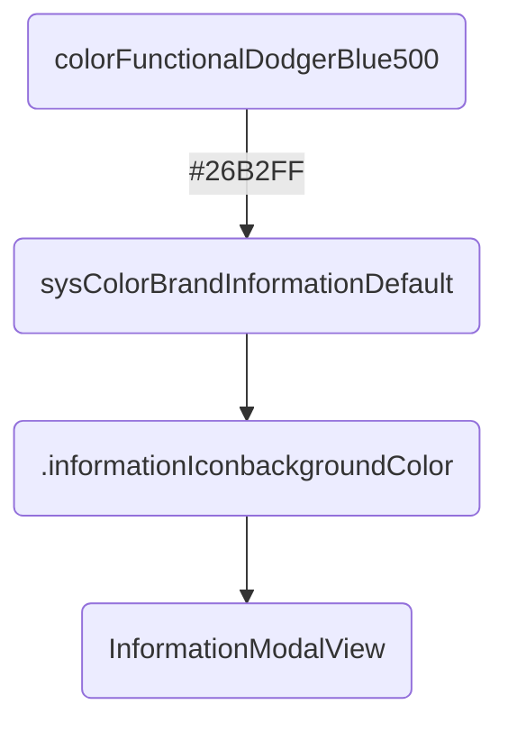

# OUDS Swift Package

- [Summary](#summary)
- [Core](#core)
  * [Components](#components)
  * [Themes](#themes)
    * [Orange](#orange)    
  * [Tokens](#components)
    * [Component tokens](#component-tokens)  
    * [Semantic tokens](#semantic-tokens)
    * [Raw tokens](#raw-tokens)
- [Modules](#modules)  
- [Foundations](#foundations)
- [Structure](#structure)
  
## Summary

This is the _Swift package_ for the iOS library of *Orange Unified Design System*.
Its structure is explained quickly in this file.

If you expect to get documentation, feel free to [use the wiki](https://github.com/Orange-OpenSource/ouds-ios/wiki) and the [online documentation](https://ios.unified-design-system.orange.com).

## Core

### Components

Contains all the components provide dby the library with also helpers and extensions.

### OUDS

Contains the files for the main module with the logic for the theme management

### Themes

Contains the themes definitions exposed by the library.

#### Orange

Contains the Orange theme definition:
- Declarations: declaration of Swift enum for Orange theme specific raw tokens
- Providers: definitions of the tokens providers for the Orange theme
- TypeAliases: definitions of type aliases for raw tokens
- Values/RawTokens: definitions of the raw tokens for the Orange theme
- Values/SemanticTokens: definitions of the semantic tokens for the Orange theme through tokens providers

### Tokens

Contains the common raw, semantic and components tokens definitions.

About responsabilities:

Example:

#### Component tokens

Contains the tokens for components.

#### Semantic tokens

Contains the semantic tokens:
- Multiples: declarations of Swift classes for doubled-values
- Providers: definitions of type alaises for the providers of semantic tokens
- TypeAliases: type aliases definitions for the semantic tokens
- Values: declarations of the semantic tokens in protocols

#### Raw tokens

Contains the raw tokens:
- Composites: declarations of Swift classes for composite raw tokens
- Declarations: declarations of Swift enums for the raw tokens
- TypeAliases: definitions of type alaises for the raw tokens
- Values: definitions of the values of the tokens, updated by *tokenator*

## Modules

Contains the modules exposed by the project.

## Foundations

Contains helpers and utils.
