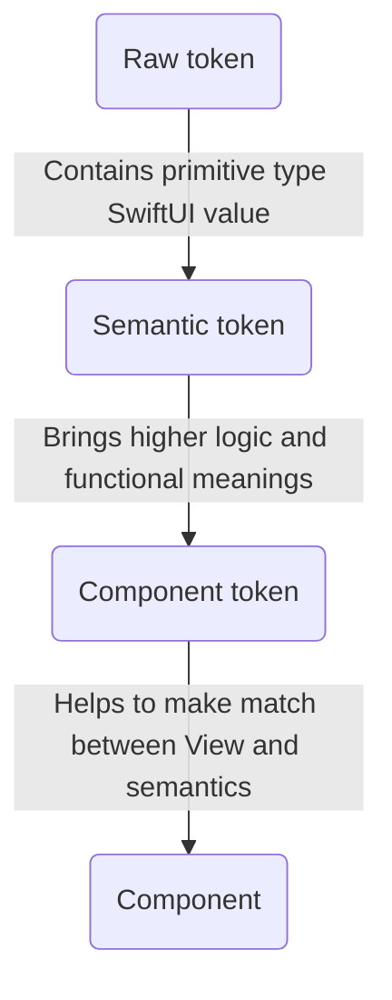
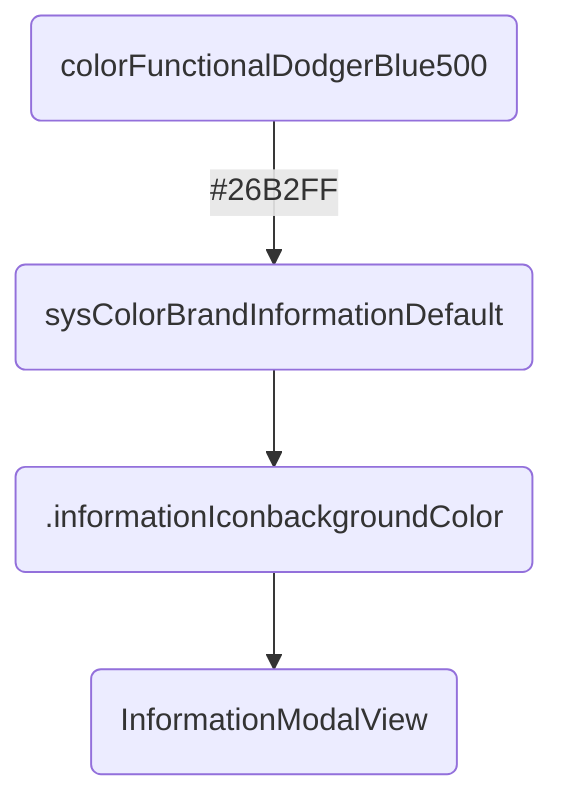

# OUDS Swift Package

- [Summary](#summary)
- [Exposed SPM modules](#exposed-spm-modules)
- [Modules](#modules)
- [Core](#core)
  * [Components](#components)
  * [Themes](#themes)
  * [Tokens](#components)
  * [Component tokens](#component-tokens)  
  * [Semantic tokens](#semantic-tokens)
  * [Raw tokens](#raw-tokens)
- [Foundations](#foundations)
- [Structure](#structure)
  
## Summary

This is the _Swift package_ for the iOS library of *Orange Unified Design System*.
It contains modules, components, themes, and tokens (of components, semantic and raw) defined by the design team in charge of a unified design.

## Exposed SPM modules

This _Swift package_ exposes up to 9 _products_ as _libraries_:
1. `OUDSModules` containing OUDS modules with features ;
2. `OUDSComponents` containing all components embeded also inside _modules_ ;
3. `OUDSThemesInverseTheme` providing a _theme_ with inverted colors for _components_;
4. `OUDSThemesOrangeTheme` providing the default _Orange_ theme defining style for _components_;
5. `OUDS` providing basic objects and low layer of responsabilities to help to implement _themes_ ;
6. `OUDSTokensComponent` providing _component tokens_ for _components_ to add in applications and _modules_ ;
7. `OUDSTokensSemantic` providing _semantic tokens_ ; 
8. `OUDSTokensRaw` providing _raw tokens_ ;
9. `OUDSFoundations` providing low level and utils objects.

Feel free to read [this Swift documentation](https://docs.swift.org/package-manager/PackageDescription/PackageDescription.html) if you are not used to _SPM_.

## Modules

A _module_ can be seen as a set of features and components to fill a need.
There is not module yet.

## Core

### Components

_Components_ are defined here and can be integrated in views.
Components use *semantic tokens* can be be integrated in *modules*.

### Themes

_Themes_ are applications of specific values for _components tokens_ and _semantic tokens_ sung _raw tokens_.
A _theme_ contains any relevant _semantic tokens_ and _component tokens_ which can be used for components rendering.
A _theme_ has also _raw tokens_ associated to primitive types so as to give to _components_, written with _SwiftUI_, the needed values in the suitable type. A _theme_ can add for itself any new _tokens_.

This library exposes today up to two themes:
1. `OrangeTheme` which can be seen as the default _theme_
2. `InverseTheme` for very particumar use cases.

The `OUDSTheme` must be seen as a kind of abstract theme.

_Themes_ are defined with `open class` in Swift. It allows inheritance and derivation.
_Themes_ have Swift _extensions_ so as to get the _tokens_ to define. These tokens are overriden thanks to `@objc open` combination so as to make possible to override these values in extensions (thanks to `@objc`) and from objects outside the module (thanks to `open`). Thus we can split values and responsabilities in different _Swift Package Manager targets_ and keep overriding and inheritance possible.

### Tokens

About responsabilities:

Example:

#### Component tokens

These _tokens_ can be used to apply some style and configuration values to _components_.
Thus if a component need to change for example its _background color_, and if a _component token_ is used for it, then only the value of this _token_ should be changed without any modification on the _component_ definition.
_Components_ use _component tokens_ exposed through the _theme_ to get their style values.

#### Semantic tokens

These _tokens_ can be used mainly for _component tokens_ to apply some style and configuration values.
They can be seen as an high level of usage with functional meanings.

Thus if we need for example to change a warning color, supposing this color is defined as a _semantic token_, we only have to change its assigned value and all components using the _semantic token_ won't be impacted in their definition.
In addition, there are hundreds of _semantics tokens_ and we needed to add them to the abstract root theme using extensions for clarity reasons to prevent to have a _Swift class_ with thousands of lines. Each _semantic token_ "family" is then declared in its dedicated _Swift protocol_ any root theme must implement through wrappers. Because we choose to split responsabilities and objects into their own modules, we faced troubles to make possible for children themes to override properties declared in _protocols_ and defined in _extensions_.
That is the reason why tokens are exposed as `@objc open` to be available and oveeridable anywhere. 
To keep the same semantics as the ones used in our specifications, _typealias_ are used so as to make the links to _primitive types_ and our logic of _tokens_. These type aliases are available for those who want to make their own theme.

#### Raw tokens

_Raw tokens_ are smallest _tokens_ possible. They are associated to raw values and will be finaly the values assigned to the _components_ properties.

In fact, we choose to use as most as possible primitive types for raw values, like `Int`, `Double`, `CGFloat` or `String` so as to handle the smallest types with few impacts on the memory for ecodesign principles. Indeed with hundreds of raw tokens, it will be more efficient to store primitive small types than structs or classes.
So we expose also in higher level some properties so as to convert when needed some of these types to `SwiftUI` types (like `Font.Weight` and `Color`).
To keep the same semantics as the ones used in our specifications, _typealias_ are used to as to make the links to _primitive types_ and our logic of _tokens_. These type aliases are available for those who want to make their own theme.

Using more simple and primitive types will help also to test the library. With also type aliases we force users to use our types and not higher level types like _SwiftUI_ types.

We also choose to add in _extension_ all the tokens values in a separated file so as to help the *Figma*-JSON-to-Swift parser to build files to copy and past easily in the project and keeping all the other objects.

## Foundations

_Foundations_ contain some extensions and objects shared between any higher levels of the library.

## Structure

Here are some explainations about the structure of the directory:
- Core: contains components, OUDS, themes and tokens modules 
- Core/Components: contains components and also helpers and view modifiers for them
- Core/OUDS/OUDSTheme: contains the definition of the abstract theme with generated code and also unit tests
- Core/OUDS/OUDSTheme/OUDSTheme+SemanticTokens: contains all the semantic tokens values, generated or not
- Core/Themes: contains the themes definitions exposed through OUDS
- Core/Themes/Inverse: contains the definition of the inverse theme, and tests
- Core/Themes/Orangee: contains the definition of the Orange theme, and tests
- Core/Themes/Orange/Declarations: contains declaration of raw tokens dedicated to Orange theme
- Core/Themes/Orange/TypeAliases: contains declaration of type aliases for raw tokens dedicated to Orange theme
- Core/Themes/Orange/Values: contains definitions of raw tokens dedicated to Orange theme, generated or not
- Core/Tokens/ComponentTokens: contains components tokens
- Core/Tokens/RawTokens: contains declarations of raw tokens, and tests
- Core/Tokens/RawTokens/Composites: contains declarations of composite raw tokens
- Core/Tokens/RawTokens/Declarations: contains declarations of not-composite raw tokens
- Core/Tokens/RawTokens/TypeAliases: contains declarations of typealiases for raw tokens
- Core/Tokens/RawTokens/Values: contains definitions of raw tokens, generated or not, composites or not
- Core/Tokens/SemanticTokens: contains declarations of semantic tokens, and tests
- Core/Tokens/SemanticTokens/Multiples: contains declarations of multiple semantic tokens
- Core/Tokens/SemanticTokens/TypeAliases: contains declarations of typealiases for semantic tokens tokens
- Core/Tokens/SemanticTokens/Values: contains declarations of raw tokens, generated or not, composites, multiple or not
- Core/Tokens/SemanticTokens/Wrappers: contains definitions of wrappers or tokens
- Foundations: contains helpers, low level objects and utilities and tests
- Modules: contains modules and tests
