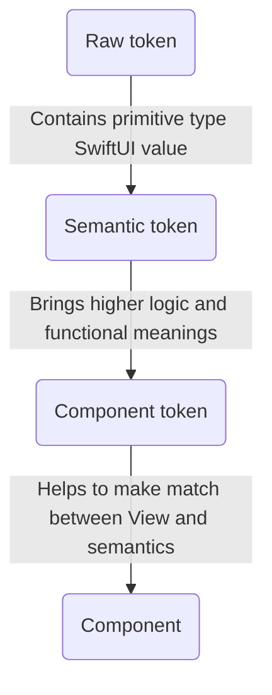
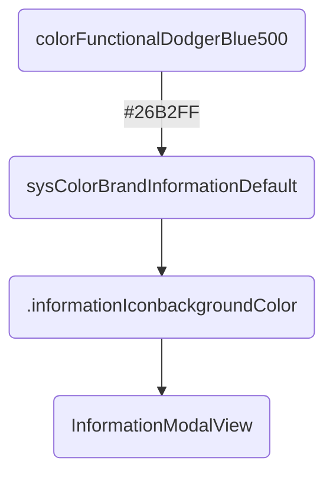

# OUDS Swift Package

## Summary

This is the _Swift package_ for the iOS library of *Orange Unified Design System*.
It contains modules, components, themes, and tokens (of components,s emantic and raw) defined by the design team in charge of a unified design.

## Exposed SPM modules

This _Swift package_ exposes up to #0 _products_ as _libraries_:
1. `OUDSModules` containing OUDS modules with features ;
2. `OUDSComponents` containing all components embeded also inside _modules_ ;
3. `OUDSThemesSoshTheme` providing the default _Sosh_ theme defining style for _components_;
4. `OUDSThemesInverseTheme` providing a _theme_ with inversed colors for _components_;
5. `OUDSThemesOrangeTheme` providing the default _Orange_ theme defining style for _components_;
6. `OUDSThemesShared` providing basic objects and low layer of responsabilities to help to implement _themes_ ;
7. `OUDSTokensComponent` providing _component tokens_ for _components_ to add in applications and _modules_ ;
8. `OUDSTokensSemantic` providing _semantic tokens_ ; 
9. `OUDSTokensRaw` providing _raw tokens_ ;
10. `OUDSFoundations` providing low level and utils objects.

Feel free to read [this Swift documentation](https://docs.swift.org/package-manager/PackageDescription/PackageDescription.html) if you are not used to _SPM_.

## Core

### Components

_Components_ are defined here and can be integrated in applications.

### Themes

_Themes_ are applications of specific values for _components tokens_ and _semantic tokens_.
A _theme_ contains any relevant _semantic tokens_ and _component tokens_ which can be sued for components rendering.
A _theme_ has also _raw tokens_ associated to primitive types so as to give to _components_, written with _SwiftUI_, the needed values in the suitable type. A _theme_ can add for itself any new _tokens_.

This library exposes today up to two themes:
1. `OrangeTheme` which can be seen as the default _theme_
2.  `SoshTheme` for Sosh.

They both are based on an `OUDSTheme` defining default values.

_Themes_ car defined thanks to `open class` in Swift. It allows inheritance and derivation.
_Themes_ have Swift _extensions_ so as to get the _tokens_ to define. These tokens are overriden thanks to `@objc open` combination so as to make possible to override these values in extensions (thanks to `@objc`) and from objects outside the module (thanks to `open`). Thus we can split values and responsabilities in different _Swift Package Manager targets_ and keep overriding and inheritance possible?

### Tokens

About responsabilities:

Example:

#### Component tokens

These _tokens_ can be used to apply some style and configuration values to _components_.
Thus if a component need to change for example its _background color_, and if a _component token_ is used for it, then aonly the value of this _token_ should be changed without any modification on the _component_ definition.

#### Semantic tokens

These _tokens_ can be used mainly for _component tokens_ to apply some style and configuration values.
They can be seen as an high level of usage with functional meanings.
Thus if we need for example to change a warning color, supposing this color is defined as a _semantic token_, we onlyhave to change its assigned value and all components using the _semantic token_ won't be impacted in their definition.

#### Raw tokens

_Raw tokens_ are smallest _tokens_ possible. They are associated to raw values and will be finaly the values assigned to the _components_ properties.

## Foundations

_Foundations_ contain some extensions and objects shared between any higher levels of the library.

## Modules

A _module_ can be seen as a set of features and components to fill a need.
There is not module yet.
