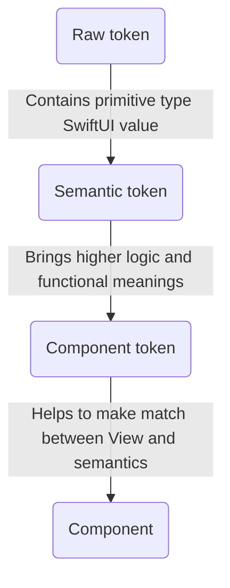
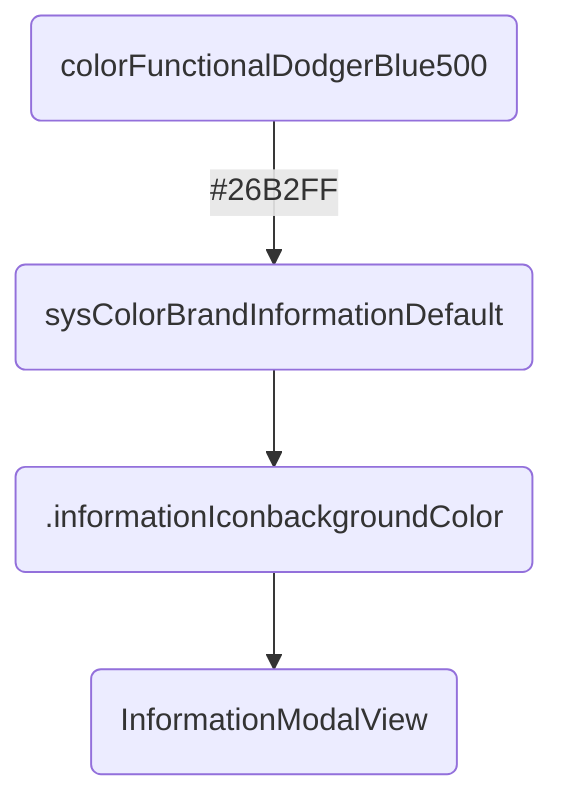

# Tokens

Design tokens represent the small, repeated design decisions that make up a design system's visual style. Tokens replace static values, such as hex codes for color, with self-explanatory names.

About responsabilities:


Example:


## Component tokens

These _tokens_ can be used to apply some style and configuration values to _components_.
Thus if a component need to change for example its _background color_, and if a _component token_ is used for it, then only the value of this _token_ should be changed without any modification on the _component_ definition.
_Components_ use _component tokens_ exposed through the _theme_ to get their style values.

Example with `FormsTextInputComponentToken`:

```swift
public protocol FormsTextInputComponentToken {
    var ftiTitleFontWeight: TypographyFontWeightSemanticToken { get }
    var ftiTitleFontSize: TypographyFontSizeSemanticToken { get }
    var ftiTitleColor: ColorSemanticToken { get }
    
    var ftiBorderColor: ColorSemanticToken { get }
    var ftiBorderStyle: BorderStyleSemanticToken { get }
    var ftiBorderWidth: BorderWidthSemanticToken { get }
}

extension OUDSTheme: FormsTextInputComponentToken {
    private static let defaultBlack: ColorSemanticToken = ColorRawTokens.colorFunctionalBlack
    private static let defaultWhite: ColorSemanticToken = ColorRawTokens.colorFunctionalWhite

    @objc open var ftiTitleFontWeight: TypographyFontWeightSemanticToken { fontWeightHeading }
    @objc open var ftiTitleFontSize: TypographyFontSizeSemanticToken { fontSizeLabelLarge }
    @objc open var ftiTitleColor: ColorSemanticToken { colorContentBrandPrimaryLight ?? Self.defaultBlack }
    
    @objc open var ftiBorderColor: ColorSemanticToken { colorBorderEmphasisLight ?? Self.defaultBlack }
    @objc open var ftiBorderStyle: BorderStyleSemanticToken { borderStyleDefault }
    @objc open var ftiBorderWidth: BorderWidthSemanticToken { borderWidthThin }
}

```

## Semantic tokens

These _tokens_ can be used mainly for _component tokens_ to apply some style and configuration values.
They can be seen as an high level of usage with functional meanings.
Thus if we need for example to change a warning color, supposing this color is defined as a _semantic token_, we onlyhave to change its assigned value and all components using the _semantic token_ won't be impacted in their definition.

In addition, there are hundreds of _semantics tokens_ and we needed to add them to the abstract root theme using extensions for clarity reasons to prevent to have a _Swift class_ with thousands of lines. Each _raw token_ "family" is then declared in its dedicated _Swift protocol_ any root theme must implement. Because we choose to split responsabilities and objects into their own modules, we faced troubles to make possible for children themes to override properties declared in _protocols_ and defined in _extensions_.

That is the reason why tokens are exposed as `@objc open` to be available and oveeridable anywhere. 

To keep the same semantics as the ones used in our specifications, _typealias_ are used to as to make the links to _primitive types_ and our logic of _tokens_. These type aliases are avaialble for those who want too make their own theme.

Example with ``ColorSemanticTokens``:

```swift
protocol ColorSemanticTokens {
    var sysColorBrandNeutralMutedWhite: ColorAliasSemanticToken? { get }
}

extension OUDSTheme: ColorSemanticTokens {

    @objc open var sysColorBrandNeutralMutedWhite: ColorAliasSemanticToken? { ColorRawTokens.colorFunctionalWhite }
}
```

## Raw tokens

_Raw tokens_ are smallest _tokens_ possible. They are associated to raw values and will be finaly the values assigned to the _components_ properties.

In fact, we choose to use as most as possible primitive types for raw values, like `Int`, `Double`, `CGFloat` or `String` so as to handle the smallest types with few impacts on the memory for ecodesign principles. Indeed with hundreds of raw tokens, it will be more efficient to store primitive small types than structs or classes.

So we expose also in higher level some properties so as to convert when needed some of these types to `SwiftUI` types (like `Font.Weight` and `Color`).

To keep the same semantics as the ones used in our specifications, _typealias_ are used to as to make the links to _primitive types_ and our logic of _tokens_. These type aliases are avaialble for those who want too make their own theme.

Using more simple and primitive types will help also to test the library. With also type aliases we force users to use our types and not higher level types like _SwiftUI_ types.

Example for `ColorRawTokens`:

```swift
// Define types for color raw tokens
public typealias ColorRawToken = String

public enum ColorRawTokens { // Gathers all color raw tokens

    public static let colorFunctionalWhite: ColorRawToken = "#FFFFFF"
    public static let colorFunctionalScarlet400: ColorRawToken = "#FF4D4E"
    public static let colorTransparentBlack0: ColorRawToken = apply(opacity: OpacityRawTokens.opacity0, on: colorFunctionalBlack)
    ...
}

extension String {
    public var color: Color {
        Color(hexadecimalCode: self)
    }
}
```

### See
``TypographyRawTokens``
